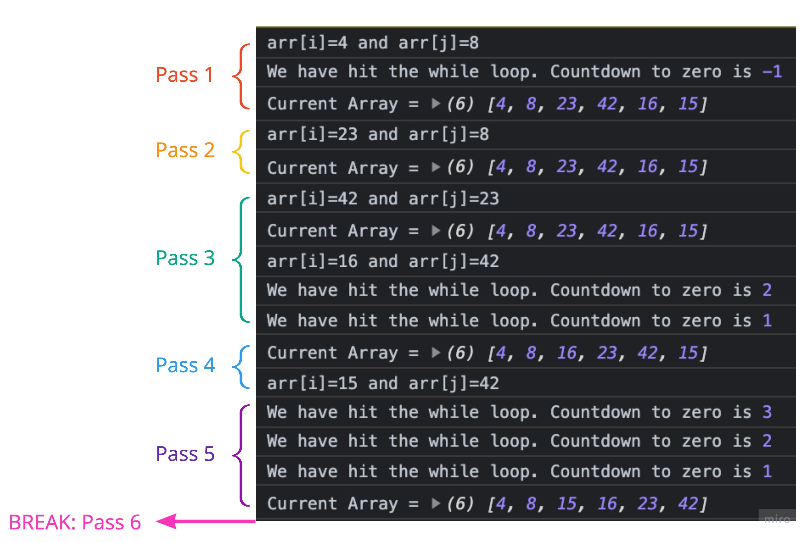

# Insertion Sort

Insertion Sort is a way to sort items in an array in JavaScript.

## Pseudocode

```js
  InsertionSort(int[] arr)

    FOR i = 1 to arr.length

      int j <-- i - 1
      int temp <-- arr[i]

      WHILE j >= 0 AND temp < arr[j]
        arr[j + 1] <-- arr[j]
        j <-- j - 1

      arr[j + 1] <-- temp
```

## Trace

Let's now see how this works in action. Below is a sample array titled `Input Array`. We will move step-by-step through each item in the Input Array following the logical steps written in the above pseudocode. Since there are 6 items in the array, there will be 6 passes.

Input Array: `[8, 4, 23, 42, 16, 15]`

## Pass 1

On the first pass, the script takes the value at index 1 which sets `arr[i]=4`. It then sets `j` to `i - 1`, which is index 0; this value is `8`. We now have `4 = arr[i]` and `8 = arr[j]` for the first pass. Since `8 > 4`, we move `8` one value to the right. We do hit the while loop, but this breaks after 1 loop when `j` is less than 0. This is a check to make sure there are no numbers to the left that are also less than `4`. This means we are at the first index of the array, meaning we can't move left any further.

`Current Array = [ 4, 8, 23, 42, 16, 15 ]`

## Pass 2

On the second pass, the script takes the value at index 2 which is `23`. It then sets `j` to `i - 1`, which is index 1; this value is `8` since we just moved `8` to the left after the first pass. We now have `23 = arr[i]` and `8 = arr[j]`. Since `8 < 23`, we move `23` one value to the right.

`Current Array = [ 4, 8, 23, 42, 16, 15 ]`

## Pass 3

On the third pass, the script takes the value at index 3 which is `42`, and sets it to `arr[i]`. It then sets `j` to `i - 1`, which is index 2; this value is `23` since we just moved `23` to the left after the second pass. We now have `42 = arr[i]` and `23 = arr[j]`. Since `23 < 43`, none of the values move.

`Current Array = [ 4, 8, 23, 42, 16, 15 ]`

## Pass 4

On the forth pass, the script takes the value at index 4 which is `16`, and sets that to `arr[i]`. It compares this to index 3, which is still `42`, meaning `arr[i] = 16` and `arr[j] = 42`. Since `16 < 42`, `16` moves to the left. Here's where the while loop kicks in again. This initiates the comparison of `16` to `23`, and because `16 < 23`, `16` moves to the left again. Because `16 !< 8`, the while loop breaks, and the 4th pass is complete.

`Current Array= [ 4, 8, 16, 23, 42, 15 ]`

## Pass 5

On the fifth pass, we are now at index 5, the end of the array; this is value `15`. Because `15 < 42`, 15 moves to the left, and just like on pass 4 the while loop is hit and the values are compared as `j` is decreased with each comparison until `arr[i]` is not less than `arr[j]`. This lands the value of `15` and index 2

`Current Array = [ 4, 8, 15, 16, 23, 42 ]`

## Pass 6

On the 6th pass, `i` is no longer less than `arr.length`, so the loop ends and the sorted array is returned, having been updated in-place.

`return Current Array = [ 4, 8, 15, 16, 23, 42 ]`

## Visual output the console log

The following is an output of various console.logs in the loops to see how the array updates after each for loop and to see when the while loop is entered.

