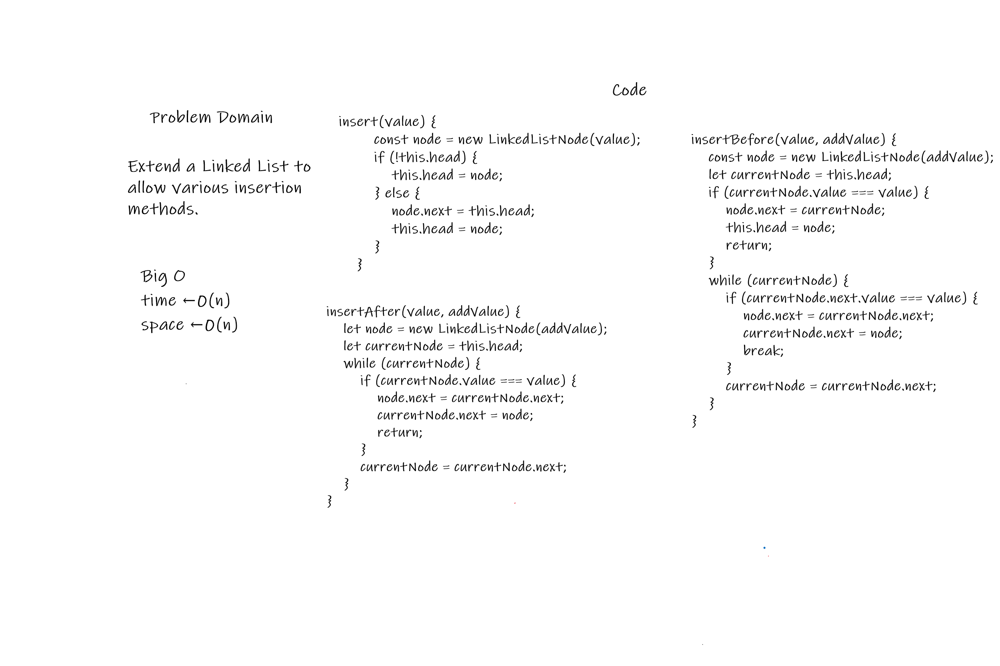

# linked-list-insertions

<!-- Description of the challenge -->

Extend a Linked List to allow various insertion methods.

## Whiteboard Process

<!-- Embedded whiteboard image -->

## Approach & Efficiency

<!-- What approach did you take? Discuss Why. What is the Big O space/time for this approach? -->

A class was created along with the methods... a helper function, fromValues was created to help in inserting multiple values at once for testing purposes and whatnot.
