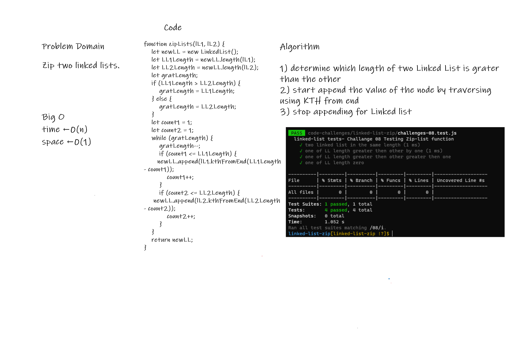

# linked list zip

<!-- Description of the challenge -->

Extend a Linked List to allow Zip two linked lists.

## Whiteboard Process

<!-- Embedded whiteboard image -->

## Approach & Efficiency

<!-- What approach did you take? Discuss Why. What is the Big O space/time for this approach? -->

A class was created along with the methods... zipLists to allow Zip two linked lists.
