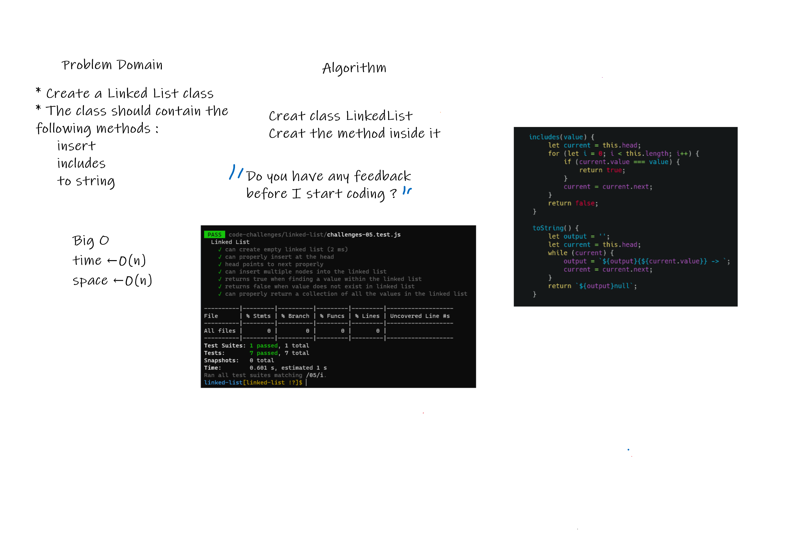

# Singly Linked Lists

<!-- Description of the challenge -->

Create a Node class that has properties for the value stored in the Node, and a pointer to the next Node.

Create a Linked List class. Within your Linked List class, include a head property.

## Whiteboard Process

<!-- Embedded whiteboard image -->

## Approach & Efficiency

<!-- What approach did you take? Discuss Why. What is the Big O space/time for this approach? -->

A class was created along with the methods... a helper function, fromValues was created to help in inserting multiple values at once for testing purposes and whatnot.
