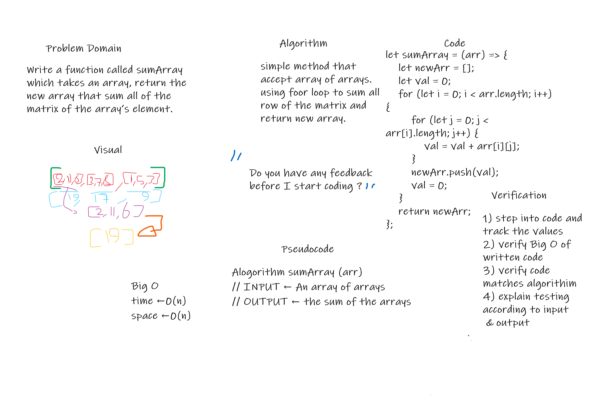

# Sum an Array

<!-- Description of the challenge -->

Write a function called sumArray which takes in matrix array , return the sum of the array’s element into new array.

## Whiteboard Process

<!-- Embedded whiteboard image -->

## Approach & Efficiency

<!-- What approach did you take? Discuss Why. What is the Big O space/time for this approach? -->

simple insted for loop to iterate over the given array, to sum any rows of matrix
